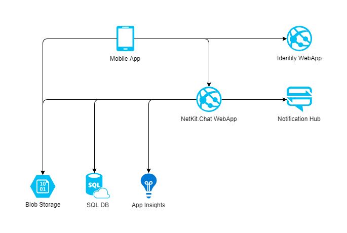
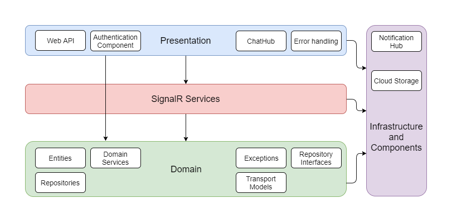



# NetKit.Chat

NetKit.Chat is open source product which used to communicate people in real time. Chat provide you ability to send group and direct messages including images, manage groups and receive push notifications.
This project uses ASP.NET Core 2.2 version.

## Features

 - Channels
   - Create new (group or personal)
   - Edit group chat (change name and logo)
   - Close channel
   - Invite members
   - Leave channel
   - Pin/unpin channel in list
   - Mute/unmute channel
   - Last read message
 - Messages
   - Add/Edit/Delete
   - Add message attachements
   - Search messages
   - Paginate messages
 - Members
   - Activate user
   - Search members
   - Subscribe/Unsubscribe on/from push notifications
   - Change notification settings

## Table of Contents

1. [Core dependencies](#Core-dependencies)
2. [Softeq dependent packages](#Softeq-dependent-packages)
3. [Dependent projects](#Dependent-projects)
4. [Additional documentation](#Additional-documentation)
5. [Development setup](#Development-setup)
6. [Comprehensive examples](#Comprehensive-examples)
7. [About](#About)
8. [Contributing](#Contributing)
9. [License](#License)

## Core dependencies

The following list contains all external core dependencies of NetKit.Chat projects:

 - Microsoft.NETCore 2.0
 - Autofac 4.8.1
 - Autofac.Extensions.DependencyInjection 4.3.0
 - CorrelationId 2.1.0
 - Dapper 1.50.5
 - IdentityServer4.AccessTokenValidation 2.6.0
 - Microsoft.AspNetCore.App 2.1.4
 - Microsoft.AspNetCore.SignalR 1.0.3
 - Simple.Migrations 0.9.19

## Softeq dependent packages

Table of Softeq [nuget](https://www.nuget.org/profiles/Softeq) dependencies.

| Package | Version | Downloads| NuGet |
| ------------------- | ----------------- | ---------------- | ----------------- |
| [Serilog.Extension](https://github.com/Softeq/serilog.extension) | 1.0.0 |   |   |
| [QueryUtils](https://github.com/Softeq/query-utils) | 1.0.2 |   |   |
| [CloudStorage.Extension](https://github.com/Softeq/CloudStorage.Extension) | 1.0.1 |   |   |
| [PushNotificationService](https://github.com/Softeq/PushNotificationService) | 1.0.3 |   |   |
| [NetKit.Chat.TransportModels](https://github.com/Softeq/NetKit.Chat.TransportModels) | 1.0.0-alpha3 |   |   |
| [NetKit.Chat.SignalRClient](https://github.com/Softeq/NetKit.Chat.SignalRClient) | 1.0.5-alpha3 |   |   |

## Dependent projects

- The [NetKit.Auth](https://github.com/Softeq/NetKit.Auth) is IdentityServer service which used to provide authentication functionality and receive access and refresh tokens according to specified scope. You should provide appropriate configuration for this service in ```Authentications``` settings section of your ```appsettings.json``` file.
- The [XToolkit.Chat](https://github.com/Softeq/XToolkit.Chat) is based on Xamarin cross-platform mobile client (iOS and Android) of NetKit.Chat.

## Additional documentation

In the following document you can find actual [WebSockets documentation](ChatHub.md) for NetKit.Chat. 

You can find all NetKit.Chat WebSockets events in the [Wiki](https://github.com/Softeq/NetKit.Chat.SignalRClient/wiki/Chat-events) document.

To ensure transparency of interaction between NetKit.Chat and other clients like [XToolkit.Chat](https://github.com/Softeq/XToolkit.Chat) the common transport models was handed out into separate package named [NetKit.Chat.TransportModels](https://github.com/Softeq/NetKit.Chat.TransportModels). This package contains all transport models for both protocols WebSockets and HTTP. 

In turn, the client which directly interacts with backend has been allocated in the separate package [NetKit.Chat.SignalRClient](https://github.com/Softeq/NetKit.Chat.SignalRClient). 

The following table reflects how different activities supports by different protocols:

| Action | REST | SignalR | Hub Event |
| ------------------- | :---: | :---: | :---: |
| Create message | + | + | MessageAdded |
| Delete message | + | + | MessageDeleted, ChannelUpdated |
| Update message | + | + | MessageUpdated |
| Add message attachment | + | - | |
| Delete message attachment | + | - | |
| Mark as read message | + | + | LastReadMessageChanged |
| Activate user | + | - | |
| Invite member | + | + | MemberJoined |
| Invite multiple members | + | + | MemberJoined |
| Get paged members | + | - | |
| Get user notification settings | + | - | |
| Update user notification settings | + | - | |
| Subscribe user on push-notifications | + | - | |
| Unsubscribe user from push-notifications | + | - | |
| Delete member | + | + | MemberLeft |
| Create channel | + | + | MemberJoined |
| Create direct channel | + | + | MemberJoined |
| Update channel | + | + | ChannelUpdated |
| Close channel | + | + | ChannelClosed |
| Leave channel | + | + | MemberLeft |
| Mute/unmute channel | + | + | - |
| Pin/unpin channel | + | + | - |
| Get my channels | + | - | |
| Get allowed channels | + | - | |
| Get channel participants | + | - | |
| Get channel settings | + | - | |
| Get channel messages number | + | - | |
| Search messages | + | - | |
| Get storage access token | + | - | |

## Development setup

Product's dependencies are installed as NuGet-packages. You can restore it using ```nuget restore Softeq.NetKit.Chat.sln``` command.

Product is fully covered of unit tests written with ```xUnit``` and ```FluentAssertions``` packages. To check the integrity of the code you can run them.

NetKit.Chat project uses Microsoft Azure Cloud hosting platform. 

To ensure the full operation of the application, you must configure the following Microsoft Azure services and extract settings from them for the further configuration of the application:

- Azure SQL Database and SQL Server
- Azure Blob Storage
- Azure Notification Hubs
- Azure Application Insights
- Azure Web App Service

Azure services interaction scheme:



The following diagram demonstrates current solution architecture:



The following code fragment contains NetKit.Chat ```appsettings.json``` template configuration file:

```json
{
  "Database": {
    "ConnectionString": "[connection string to SQL Server database]",
    "TransactionConfiguration": {
      "TransactionTimeoutInMinutes": 1
    }
  },
  "AzureStorage": {
    "ConnectionString": "[connection string to azure storage]",
    "ContentStorageHost": "[content storage host]",
    "MessageAttachmentsContainer": "message",
    "MemberAvatarsContainer": "avatar",
    "ChannelImagesContainer": "channel",
    "TempContainerName": "temp",
    "MessagePhotoSize": 300
  },
  "Authentications": {
    "Bearer": {
      "ApiSecret": "[secret]",
      "Authority": "[Url authority]",
      "RequireHttpsMetadata": false,
      "ApiName": "[api]"
    }
  },
  "AzureNotificationHub": {
    "ConnectionString": "[connection string]",
    "HubName": "[hub name]"
  },
  "Message": {
    "MessageAttachmentsLimit": 10,
    "LastMessageReadCount": 20
  },
  "ApplicationInsights": {
    "InstrumentationKey": "[instrumentation key]"
  },
  "Serilog": {
    "MinimumLevel": "Debug",
    "ApplicationName": "Softeq.NetKit.Chat",
    "FileSizeLimitMBytes": 100
  },
  "SystemMessagesTemplates": {
    "MemberJoined": "{0} joined",
    "MemberDeleted": "{0} deleted",
    "MemberLeft": "{0} left",
    "ChannelNameChanged": "name changed",
    "ChannelIconChanged": "icon changed"
  }
}
```

## Comprehensive examples

NetKit.Chat has a comprehensive [Console client](https://github.com/Softeq/NetKit.Chat.ConsoleClient) project which contains all WebSockets calls to Chat Backend using [NetKit.Chat.SignalRClient](https://github.com/Softeq/NetKit.Chat.SignalRClient) package.

## About

This project is maintained by [Softeq Development Corp.](https://www.softeq.com/)
We specialize in .NET core applications.

 - [Facebook](https://web.facebook.com/Softeq.by/)
 - [Instagram](https://www.instagram.com/softeq/)
 - [Twitter](https://twitter.com/Softeq)
 - [Vk](https://vk.com/club21079655)

## Contributing

We welcome any contributions.

## License

The NetKit.Chat project is available for free use, as described by the [LICENSE](/LICENSE) (MIT).